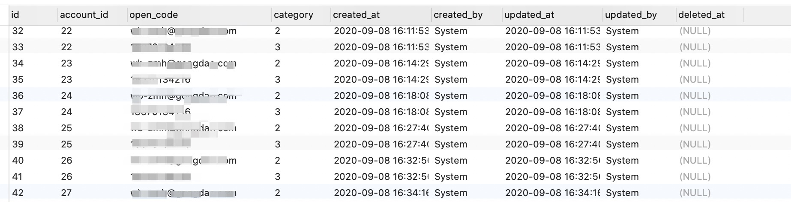

# Mysql联合唯一索引存在空值时唯一约束失效

## 问题

> 因为 gorm 的默认填充有 `deleted_at` 字段，一开始设置了 open\_code 为唯一索引，软删除再插入新数据会出现唯一索引冲突，所以把 `open_code + delete_at` 创建了联合唯一索引

然而这之后我重复插入（重复注册账号），发现 `open_code` 并不会出现唯一索引冲突，唯一登录的 `open_code` 字段重复，正常应该报索引冲突的错误。

## 背景

表有联合唯一索引如下图：


但是还是可以插入重复的 open\_code



其中脱敏的 open\_code 都是重复数据

## 原因

> A UNIQUE index creates a constraint such that all values in the index must be distinct. An error occurs if you try to add a new row with a key value that matches an existing row. This constraint does not apply to NULL values except for the BDB storage engine. For other engines, a UNIQUE index allows multiple NULL values for columns that can contain NULL.

唯一约束对NULL值不适用。原因可以这样解释： 比如我们有一个单列的唯一索引，既然实际会有空置的情况，那么这列一定不是`NOT NULL`的，如果唯一约束对空值也有起作用，就会导致仅有一行数据可以为空，这可能会和实际的业务需求想冲突的，所以通常Mysql的存储引擎的唯一索引对NULL值是不适用的。 这也就倒是联合唯一索引的情况下，只要某一列为空，就不会报唯一索引冲突。

## 解决方案

给会为空的列定义一个为空的特殊值来表示 NULL，时间的话可以选择一个历史时间 1997-07-01 00:00:00，数字类型的话可以是 -1。但是在 gorm 里面，默认是 `deleted_at` 为 NULL，在查找的时候会如下效果

```sql
SELECT count(*) FROM `xxx_user`  WHERE `xxx_user`.`deleted_at` IS NULL 
```

 如果要继续使用这个方式，那么就需要在删除的时候把唯一主键字段 +  时间去更新，但是如果 唯一字段有多个，会让人很不爽。


